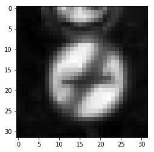
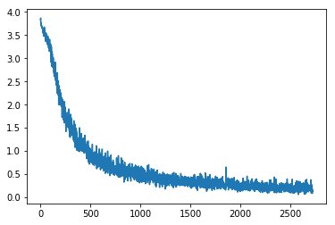
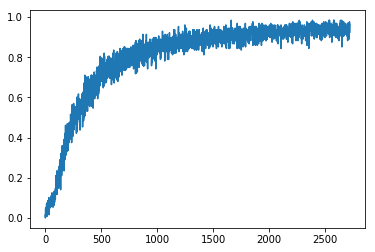
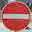
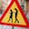
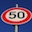
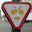

#**Traffic Sign Recognition** 

**Build a Traffic Sign Recognition Project**

## Rubric Points

### Dataset summary

Number of training examples = 34799
Number of testing examples = 12630
Image data shape = (32, 32, 3)
Number of classes = 43

### Exploratory visualization

[img summary]

We look at how many examples do we have for each of the class. Ideally, every class should have similar amount of examples, or else our accuracy score might be a poor reflection of the "real accuracy" of the system.

For example, if we want to classify 2 classes. One has 90 examples, and the other has 10 examples. If our algorithm learns to just mark all examples as the dominant class, it'll get an accuracy of 90%. However, it hasn't learnt anything. To avoid this scenario, we should have more or less the same amount of elements for each class.

### Pre-processing

The following steps are used for pre-processing:

**Conversion to grayscale:** We convert the image to grayscale. This can be thought of as dimensionality reduction, since we go from 3 channels to just 1 channel.

**Normalize image:** The numbers in grayscale are between 0 to 255. In this phase, we convert it to range from -1 to 1 (mean 0, std dev 1).

### Model architecture

The final model architecture looks like:

| Layer                 |     Description                               | 
|:---------------------:|:---------------------------------------------:| 
| Input                 | 32x32x1 Normalized Grayscale                             | 
| Convolution 5x5       | 1x1 stride, valid padding, outputs 28x28x16    |
| RELU                  |                                               |
| Max pooling           | 2x2 stride,  outputs 14x14x64                 |
| Convolution 5x5       | 1x1 stride, valid padding, outputs 10x10x32    |
| RELU                  |                                               |
| Max pooling           | 2x2 stride,  outputs 5x5x32                 |
| Convolution 5x5       | 1x1 stride, valid padding, outputs 5x5x64    |
| RELU                  |                                               |
| Max pooling           | 2x2 stride,  outputs 2x2x64                 |
| Flatten               | Outputs flat 256                 |
| Fully connected       | Outputs flat 128                                         |
| RELU                  |                                               |
| Dropout                  | keep_prob: 0.5                                              |
| Fully connected       | Outputs flat 64                                         |
| RELU                  |                                               |
| Dropout                  | keep_prob: 0.5                                              |
| Fully connected       | Outputs flat 43                                         |
| Softmax               | 43 classes                                         |
|                       |                                               |
|                       |                                               |

### Model training

A learn rate of 0.001, batch size of 128, and no. of epochs 10 were selected. The optimizer used was Adam Optimizer.

### Solution approach

I started with the LeNet architecture and tried to get a good validation accuracy. LeNet is a convnet, and convnets are generally good at classifying image data because they make use of the "spatial" data.

However, since I made an error with type-casting, the model took the normalized grayscale as integer instead of floats. This initially had me trying to figure out where the network was failing.

I thought of grayscaling as a good method of dimensionality reduction, while still retaining important information. Although I didn't use them, I researched a lot of methods for normalizing the lighting conditions of the images.

I added the dropout to avoid overfitting the model.

Things that could improve network performance further:
1. Normalize lighting conditions of the images
1. Equalize the number of examples for each class
1. Data augmentation so that network learns the examples under different conditions

I got the following results:
1. Validation accuracy: 0.948
1. Training accuracy: 0.963
1. Test accuracy: 0.931

**Plot of loss vs. batch**

**Plot of training acc. vs. batch**

### Test on new images

**1. Do not enter**

This sign should be easy to classify since it's not skewed very much.

**2. Pedestrian caution on using mobile phones**

This is a new one, so the training set didn't have it. So I'm pretty sure that the classifier might not be able to classify it properly, but it still looks similar to relevant "pedestrian" signs.

**3. Speed limit (50)**

This should get classified properly, although the skew might be too much.

**4. Stop**

Should get classified trivially.

**5. Turn right on red for bikes**

Probably not, because it's an unusual one again.

### Test results

| Image                 |     Prediction                                | 
|:---------------------:|:---------------------------------------------:| 
| Do not enter             | No entry (1.0) (CORRECT)                              | 
| Mobile phones caustion               | General caution (0.98) (INCORRECT)                                        |
| 50 km/h                 | Roundabout mandatory (0.23) (INCORRECT)                                         |
| Stop             | Roadwork (0.98) (INCORRECT)                                    |
| Turn right on red for bikes         | Yield (0.98) (INCORRECT)                                 |

